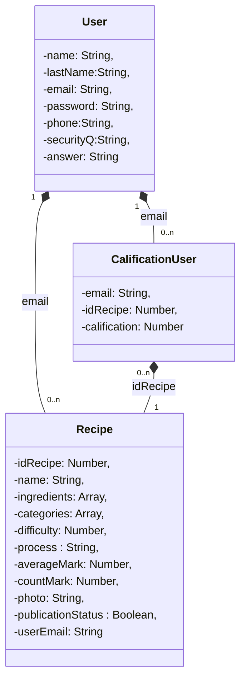

# TPO_API - Food Recipes

# Tabla de Contenidos
1. [Introducción](#Introducción)
2. [Requerimientos](#Requerimientos)
3. [Instalación](#Instalación)
4. [Funcionalidades](#Funcionalidades)
5. [Documentación](#Documentación)
6. [Integrantes](#Integrantes)


## Introducción
Este proyecto es una página web de recetas llamada *“Food Recipes”*. En la pagina web se podrán observar distintos platos de comida y bebidas con la explicación de como cocinarlas, que ingredientes son requeridos y una calificación que es en base a la votación de los usuarios. Estando registrado se pueden subir recetas y calificar la de los demás.
Esta página web se realizó con fines educativos para la materia API .

## Requerimientos

Lenguajes y librerías utilizadas en el frontend: HTML/CSS, React, JavaScript y NodeJS.

Lenguajes y librerías utilizadas en el backend: JavaScript , NodeJS y Mongoose.

Base de datos: NO SQL (MongoDB).

Link para descargarse Node.js : https://nodejs.org/es/

## Instalación
 Instrucciones de instalación frontend
```console
$ npm install
```
```console
$ npm start
```
Si todo se ejecuto correctamente deberas ser redirigido a la pagina principal de Food Recipes


Instrucciones de instalación backend
```console
$ npm install -g nodemon
```
```console
$ nodemon app.js
```
Si todo se conecto exitosamente aparecera esto en la terminal 


Archivo env.

-SECRET, la contraseña para poder crear el token que durara 24 horas.

-DATABASE1, se deberá completar con la información del usuario de la base de datos MongoDB

-DATABASE2, se deberá completar con la información de la base de datos MongoDB

-DATABASE3=true&w

-DATABASE4=majority

-HOST, completar con el número del HOST.

-PORT, completar con el número de puerto.

-DATABASE_NAME=TestUser

-DB_PORT, numero de puerto

-UPLOAD_DIR= imagenes/

-CLOUDINARY_URL, link de cloudinary.


## Funcionalidades

En la página principal se pueden ver todas las recetas que estan publicadas de los usuarios. 
Si la persona desea buscar recetas especificas puede usar el buscador el cual posee los campos : nombre , ingredientes ( que se deben separar por comas en caso de poner más de uno ), categorías de las cuales solo puede seleccionar entre 10 y por último la dificultad que va del 1 al 5.


Dentro del header el usuario puede seleccionar:

"Sobre nosotros " y será redirigido a una página que explicará detalles sobre Food recipes. Tambien puede redirigirse a esta pagina apretando el boton "sobre nosotros" en el footer de la pagina.


"Conectarse" y será redirigido a una página para poder hacer log in.


"Registrarse" y será redirigido a una página para poder registrarse como nuevo usuario.


Dentro de cada receta de la pantalla de inicio esta la opción de "leer más" , eso redirigirá a la persona a una pantalla donde podrá observar los detalles de la receta y si esta logeado podra calificarla.


Si al intentar hacer log in no recuerda su contraseña, puede seleccionar la opción de "olvide contraseña" y será redirigido a la página de recuperar contraseña.
En la misma se le pedirá su email y se buscara si es un usuario registrado para mostrarle la pregunta de seguridad que agrego cuando creo su cuenta, usted deberá contestar la respuesta y de ser correcta será redirigido a una página donde podrá recuperar su contraseña.


Si al hacer log in puede ingresar sin problemas, será redirigido a la página de su perfil donde podrá modificar cualquiera de sus datos excepto por el email.


Si aprieta el botón de "mis recetas" en su perfil o en la barra header, podrá visualizar todas las recetas que usted subió tanto las publicadas como las no publicadas.

El filtro de busqueda es similar al de la pantalla de inicio , pero aqui se filtrara en las recetas unicamente de ese usuario.


Podrá subir recetas nuevas apretando el botón "Agregar nueva receta" y será redirigido a la página de crear receta donde deberá completar todos los datos.


Si aprieta el botón de leer más en alguna de las recetas que usted creo en la pantalla de "mis recetas", podrá modificar la receta. Se puden cambiar todos los campos y tambien eliminarla.


## Documentación

Diagrama de estructura de la base de datos MongoDB


Estados de response del backend hacia el frontend

-Status 400 : Error

-Status 201: Todo se ejecuto correctamente

Codigos de error 

                                             ERROR_PASSWORD_NOT_VALID    : 1,
                                             ERROR_MAIL_NOT_ASSOCIATED   : 2,
                                             ERROR_SECURITY_ANSWER_WRONG : 3,
                                             ERROR_MAIL_IN_USE           : 4,
                                             ERROR_IN_DB_OPERATION       : 5,
                                             ERROR_RECIPE_NOT_FOUND      : 6,
                                             ERROR_RECIPE_ID_IN_USE      : 7,
                                             ERROR_DUPLICATE_CALIFY      : 8

Autenticación por token , libreria usada : JSON Web Token (JWT).  

Documentacion de las peticiones en postman : https://documenter.getpostman.com/view/21197481/UzQuN4zt

## Integrantes

Antonio Berti

Candela Esquivel
