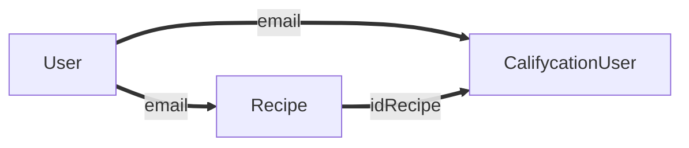
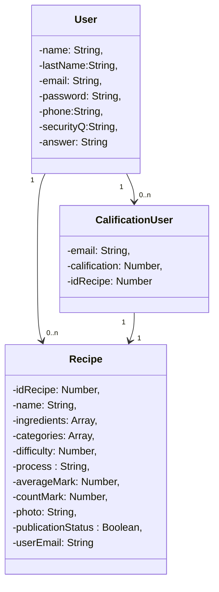

# TPO_API - Food Web page
# Tabla de Contenidos
1. [Introducción](#Introducción)
2. [Requerimientos](#Requerimientos)
3. [Instalación](#Instalación)
4. [Documentación](#Documentación)
5. [Equipo de Trabajo](#EquipodeTrabajo)
6. [Conclusión](#Conclusión)

## Introducción
Este proyecto es una página web de recetas llamada *“Food Recipes”*. En la pagina web se podrán observar distintos platos de comida y bebidas con la explicación de como cocinarlas, que ingredientes son requeridos y una calificación que es en base a la votación de los usuarios. Estando registrado se pueden subir recetas y calificar la de los demás.
Esta página web se realizó con fines educativos para la materia API .

## Requerimientos

Lenguajes y librerías utilizadas en el frontend: HTML/CSS, React, JavaScript y NodeJS.

Lenguajes y librerías utilizadas en el backend: JavaScript , NodeJS y Mongoose.

Base de datos: NO SQL (MongoDB).

Sistema Operativo :  Microsoft Windows (si se usa Mac OS o Linux los comandos seran diferentes)


## Instalación
 Instrucciones de instalación frontend
```console
$ npm install
```
```console
$ npm start
```
Si todo se ejecuto correctamente deberas ser redirigido a la pagina principal de Food Web Page 
img

Instrucciones de instalación backend
```console
$ npm install -g nodemon
```
```console
$ nodemon app.js
```
Si todo se conecto exitosamente aparecera esto en la terminal 


Archivo env.


## Documentación
Diagrama de relaciones

Diagrama de clases


Estados de response del backend hacia el frontend

-Status 400 : Error
-Status 201: Todo se ejecuto correctamente

Codigos de error 


Autenticación por token

Libreria usada : JSON Web Token (JWT)       

Se pedira en las siguientes peticiones :

-Actualizar información del usuario
-Actualizar información de la receta
-Obtener recetas del usuario
-Eliminar una receta
-Crear una receta
-Calificar una receta

Endpoints


## Equipo de Trabajo
Antonio Berti

Candela Esquivel

## Conclusión


